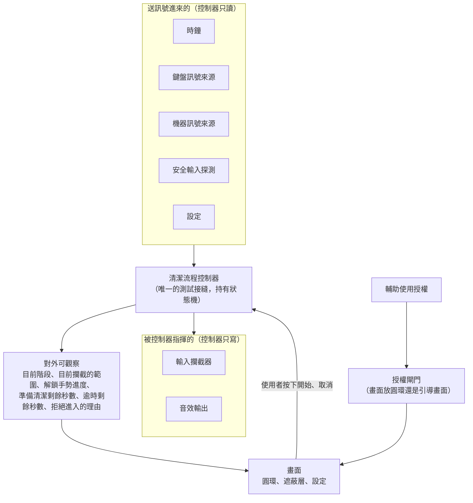

# Wipe 的接縫地圖

這份文件回答兩件事：接縫是什麼，以及這個專案有哪些接縫。

它是給人看的地圖，不是規格。每一個接縫該提供什麼，以 #1 的 Implementation Decisions 為準。

## 接縫是什麼

想像牆上的**插座**。檯燈不在乎插座後面接的是台電的電網，還是一顆行動電源。它只認得插座那個形狀。

接縫就是程式裡的插座。它是一個約定好的形狀，一邊插著真實世界（真的鍵盤、真的時間、真的喇叭），另一邊插著程式的邏輯。因為形狀是約定好的，測試的時候可以把真實世界那一頭拔掉，換上一個假的插進去。

為什麼需要這樣做？因為 Wipe 大部分的行為，測試沒辦法真的重現：

- 「五分鐘之後自動解除」，總不能讓測試真的等五分鐘。
- 「闔上螢幕蓋子就解除」，測試機沒有手可以闔蓋子。
- 「攔截鍵盤」，測試如果真的攔截了，跑測試的那台電腦就當場失去鍵盤。

有了接縫，測試可以說：「時鐘，直接跳到五分鐘後」「機器訊號，就當蓋子現在闔上了」「攔截器，你只要記下有人叫過你就好，什麼都不用真的做」。程式邏輯完全不知道自己在被騙，跑的是同一份程式碼。

反過來說，**接縫也是一種切割**。切得好，一邊的東西壞掉不會弄髒另一邊；切得太多，程式會被切得零零落落，每一塊都要花力氣維護。所以接縫要少而準。

## 這個專案只有一個測試接縫

Wipe 刻意只在**一個地方**開接縫：**清潔流程控制器**。

它是持有狀態機的那個東西，所有規格描述的行為都必須經過它。它不准直接讀系統時間、不准直接註冊系統事件、不准直接呼叫攔截 API。這些能力全部從外面注入進來。

**有一個東西站在控制器外面：授權閘門。**輔助使用授權決定的是主視窗裡放圓環還是授權引導畫面，那件事發生在流程之前，不是流程的一部分（見 #9）。它沒有被塞進控制器有兩個理由：一是控制器回到待命時會把時鐘停掉，為了盯著一個授權旗標而讓它一直空轉並不划算；二是沒有授權的時候使用者根本按不到開始，那條路走不到狀態機。所以授權那一頭插在 `AuthorizationGate` 上，形狀跟其他接縫一樣，測試那一頭也一樣是替身。

遮蔽層那一頭也有一個從外面給的東西：螢幕清單。它不算接縫，離控制器更遠，理由見下面「什麼不是接縫」那一節。

## 八個接縫

| 接縫 | 真實世界那一頭 | 測試那一頭 | 現況 |
|---|---|---|---|
| **時鐘** | 系統時間 | 測試自己推進虛擬時間 | **已做（#4）** |
| **鍵盤訊號來源** | 真的鍵盤 | 直接餵假的按鍵狀態 | **已做（#3）** |
| **機器訊號來源** | 螢幕蓋子、系統睡眠喚醒 | 直接說「蓋子闔上了」 | **已做（#7）** |
| **安全輸入探測** | macOS 的安全輸入模式 | 直接說「現在正在安全輸入模式」 | **已做（#8）** |
| **輔助使用授權** | `AXIsProcessTrusted()`、系統設定那一頁 | 直接說「使用者剛剛打勾了」 | **已做（#9）** |
| **輸入攔截器** | CGEventTap，真的丟棄事件 | 只記下「有人叫我開始攔截」，也可以說「我裝不上去」 | **已做（#11）** |
| **音效輸出** | 喇叭 | 只記下「有人叫我播哪一聲」 | **已做（#4）** |
| **設定** | 使用者存在硬碟上的偏好 | 直接給一組值 | **已做（#4、#6）** |

### 時鐘

負責回答「現在幾點」與「過了幾秒」。逾時解鎖、準備清潔的緩衝倒數、解鎖手勢按住的三秒，全部靠它。

有這個接縫，逾時相關的測試不需要真的等待。

它同時負責「每隔一小段時間叫我一次」。時間會走與時間要被讀是同一件事的兩面，
分成兩個接縫的話，測試就得同時騙兩個東西，而且還得自己讓它們對得起來。
真實那一頭是 `SystemClock`（`ProcessInfo.systemUptime` 加一個 run loop 計時器），
測試那一頭是 `TestClock`，一格一格走完測試喊的那段時間。

### 鍵盤訊號來源

回報四件事：左 Command 的按放狀態、右 Command 的按放狀態、是否夾帶其他修飾鍵、是否有其他按鍵按下。

解鎖手勢的每一條規則都建在這四個值上面，包括「出現第三顆按鍵就重新計時」。

這四個值是**推**給控制器的，一次鍵盤事件推一次，而不是讓控制器定期去讀。
這個差別不是實作細節：第三顆按鍵的歸零是一個事件，不是一個狀態。
定期去讀的話，一顆被壓著不動的鍵只要壓著就會一直歸零，使用者會永遠解不開，
而永遠解不開比誤觸嚴重得多（見 #1 的實作決策）。

真實那一頭有兩個實作，因為事件從哪裡來要看攔截有沒有生效：

- `InterceptedKeyboardSignalSource`：事件從輸入攔截器來。攔截一旦真的裝上去，
  鍵盤事件就不會再送到 Wipe 自己身上，所以攔截器在丟掉事件之前先把判讀交給它。
  清潔模式期間走的是這一條。
- `LocalKeyboardSignalSource`：事件從 AppKit 的本機事件監看器來，不需要任何系統授權，
  也不攔截或修改任何事件。乾跑模式與診斷視窗走這一條。#3 已在真機上確認左右
  Command 分得開。

兩條路共用同一份累加規則（`KeyboardSignalReader`），不然同一組按鍵在兩條路上
會得到不一樣的答案。

### 機器訊號來源

回報螢幕蓋子闔上，以及系統從睡眠喚醒。這兩個是闔蓋解鎖的訊號，也是使用者「手指一定按得到」的那條出路。

蓋子雖然是主要訊號，控制器收到的仍然是**事件**而不是狀態：認的是「蓋子闔上」那一刻，不是「蓋子闔著」這個持續的狀態。接著外接螢幕闔蓋使用的人，蓋子本來就一直闔著，若認狀態，他永遠進不了清潔模式。狀態怎麼變成事件是來源自己的事，那一段抽成 `LidCloseDetector`，有測試。

目前的實作是 `SystemMachineSignalSource`。蓋子那一條每半秒問一次 IOKit 的 `AppleClamshellState`，喚醒那一條聽 `NSWorkspace.didWakeNotification`，兩條都不需要任何系統授權。蓋子刻意用定期去問而不是註冊 IOKit 的事件通知：那個訊息常數是 C 巨集算出來的，Swift 拿不到，只能自己抄數值，抄錯不會有編譯錯誤，只會安靜地不通知。闔蓋解鎖是保險，安靜地失效等於使用者被鎖在外面。

「接上外接螢幕與電源、闔蓋不會睡眠」的情況只有真機驗得到，那是手動驗收清單第 7 項。

### 安全輸入探測

查詢目前是否處於安全輸入模式，以及是哪個 app 造成的。這是 Wipe 最危險的失效來源：它啟動期間所有第三方鍵盤攔截都會被繞過，畫面會顯示清潔中，但鍵盤其實還活著。

有這個接縫，「偵測到就拒絕進入」與「進行中偵測到就立刻退出」這兩條規則測得到，不需要真的去把某個密碼欄位叫出來。真的去叫的話，跑測試的那台電腦當場就進了安全輸入模式，那跟真的攔截鍵盤一樣糟。

這個接縫刻意是**查詢**而不是推播，跟鍵盤與機器那兩個來源相反。安全輸入模式是一個持續的狀態而不是一個瞬間的事件，系統也沒有提供變化通知；控制器在清潔中本來就每一格都在跑，順手問一次就好。

目前的實作是 `SystemSecureInputProbe`。「現在是不是」問的是 Carbon 的 `IsSecureEventInputEnabled()`，那是系統唯一的官方答案，便宜到可以每一格問一次。「是哪個 app」沒有官方 API，只能從 IO 登錄檔的 `IOConsoleUsers` 挖 `kCGSSessionSecureInputPID`，再換成 app 名稱。挖不到就挖不到，拒絕照樣成立，只是畫面上少一句「去關掉哪個 app」。這一段刻意只在真的要拒絕的那一刻才跑。

拒絕不是安靜的。它會播「拒絕進入」那一聲，並把理由留在控制器上讓畫面說明白。清潔模式進行中偵測到的話走的是離開清潔中那唯一的出口，所以「一定會解除攔截」那條不變條件自動涵蓋它。

### 輔助使用授權

回答「現在有沒有輔助使用授權」，以及被要求把使用者帶去系統設定的那一頁。攔截鍵盤需要這個授權，沒有它事件攔截根本建立不起來。

真實那一頭是 `SystemAccessibilityAuthorization`：狀態問 `AXIsProcessTrusted()`，帶路那一步先送出一次系統的授權請求（副作用是讓 macOS 把 Wipe 登記進清單），再開系統設定的網址。測試那一頭是 `FakeAccessibilityAuthorization`，測試自己說使用者剛剛打勾了。真實世界裡授權只能由使用者親手給，程式沒有辦法自己打勾，所以這個接縫是必要的。

插在它上面的是 `AuthorizationGate`。它每秒問一次，兩個方向都認：打勾就放行，勾被拿掉就再關上。被收回的人確實是一個未授權的使用者，而未授權的人不該看到一顆可以按但按了沒用的開始按鈕。至於什麼時候真的把畫面換掉，那是視圖那一層的事：清潔模式與準備清潔期間不換，否則等於在使用者閉著眼睛擦機器的時候抽掉他唯一的狀態來源（見 `MainWindowView`）。

「還沒授權時整個主視窗換成引導畫面」看得出來對不對，用眼睛驗；「打完勾之後不必重開 app 就會換回圓環」看不出來，所以那一條有測試（`AuthorizationGateTests`）。

### 輸入攔截器

被要求以某個範圍（鍵盤鎖或全輸入鎖）開始攔截、被問「你還活著嗎」，以及被要求解除。

這是唯一一個「測試裡絕對不能用真貨」的接縫。真的攔截了，跑測試的那台電腦就沒有鍵盤了。

開始攔截**會回報自己有沒有真的裝上去**。授權清單記著的是舊的簽章身分時，系統會說有授權而攔截還是裝不起來，那一刻若不回報，畫面就會顯示清潔中而鍵盤還活著。控制器收到失敗時走的是跟安全輸入模式同一套：拒絕進入、出聲、把理由說出來（`CleaningRefusal.interceptionUnavailable`），畫面上那句話直接叫使用者重開 Wipe，因為那是唯一有效的動作。

真實那一頭是 `EventTapInputInterceptor`：在事件進到登入 session 的位置插一個 CGEventTap，把範圍指定的那些事件一律丟掉。它本身沒有自動化測試，因為測試裡真的裝上去，跑測試的那台電腦就當場沒有鍵盤。它裡面兩塊「錯了會安靜地失效」的判斷被抽成純值測著：範圍換成要監看哪些事件（`InterceptionScope.eventMask`），以及系統擅自停用攔截時要重新啟用（`EventTapResponse`）。其餘靠真機驗收。

攔截生效期間鍵盤事件不會再送到 Wipe 自己身上，所以攔截器同時是鍵盤訊號來源的上游：丟掉事件之前先把判讀交出去，解鎖手勢才有東西可以判。

**全輸入鎖攔得下事件，攔不住那個箭頭。**#12 在真機上驗過：全輸入鎖底下點擊、拖曳與多指手勢完全沒有反應，但螢幕上的游標照樣跟著手指移動。游標的位置是視窗伺服器直接從 HID 那一層畫的，不經過事件進到登入 session 的那個攔截點。

這個行為是接受的，沒有再往下追。兩個候選機制（把攔截點換到 HID 那一層、用 `CGAssociateMouseAndMouseCursorPosition` 把游標鎖住）都是全域性的，而本 app 有一條不能碰的線：process 一旦結束，鎖必定消失。游標移到哪裡都按不動任何東西，防護的實質沒有少，不值得拿那條線去換。畫面上的說明因此不承諾游標會停。

**範圍在裝上去的那一刻就定了。**控制器另外把它記下來對外公開，畫面顯示的是這一個值，不是設定裡現在選的那一個。兩者在清潔中會分岔：鍵盤鎖底下觸控板還活著，使用者有辦法在清潔中打開設定改範圍，而已經裝上去的攔截不會跟著變。跑到一半換範圍等於重裝一次攔截，那是在使用者閉著眼睛擦機器的時候抽掉他腳下的地板，所以不做。

**裝上去不等於一直裝著。**macOS 會在攔截處理得太慢時自己把它停掉，授權也可能在清潔中被收回，而這兩件事都不會有任何錯誤，只有事件重新流向其他 app。所以控制器在清潔中每一格問一次「你還活著嗎」，攔截器回答之前會先試著修一次；修不回來就走 `CleaningExit.interceptionLost` 那條路離開清潔中。修回來的那一刻要順手把鍵盤按著的狀態忘乾淨：停用的空窗裡使用者放開的鍵 Wipe 沒看到，留著會變成一顆永遠壓著的幽靈按鍵，而那顆鍵會讓解鎖手勢每一次都歸零。

### 音效輸出

被要求播放某個時刻的音效：倒數每一秒、真正鎖上、手勢被認到、計時歸零、解鎖成功、逾時解除、拒絕進入。

測試不需要聽聲音，只需要確認「在對的時刻叫了對的那一聲」。

### 設定

純粹的值：緩衝要不要開、幾秒、逾時幾分鐘、按住幾秒、攔截範圍、畫面呈現、各個音效開不開。這一組值是 `WipeSettings`。

它是這七個裡面最單純的一個，不需要假的實作，測試直接給一組值就好。

值外面包著 `WipeSettingsStore`，那才是真實世界那一頭：它把值存進 `UserDefaults`，也從那裡讀回來。測試那一頭是它的記憶體版本，不碰硬碟。設定視窗改的是這個 store，控制器讀的也是同一個，所以改完不必重開 app。

舊版本存下的值若落在現在的範圍之外，讀回來的時候會被拉回範圍內。這一條不是整理癖：硬碟上的舊值不可以繞過逾時的 15 分鐘上限。

注意：逾時解鎖、闔蓋解鎖、以及「解鎖手勢期間出現第三顆按鍵就重新計時」這三項**不在設定裡**，它們鎖死。設定只調整體驗，不拆保險（見 ADR-0002）。設定畫面是這條規則的守門人，`SettingsView` 的說明裡有寫。

## 一個順帶的好處：乾跑模式

「乾跑」是指真的讀鍵盤、真的跑完整個流程，但不真的鎖住鍵盤。開發期間非常需要它，否則每改一行程式都要冒著把自己鎖在外面的風險。

乾跑**不需要**成為第二個接縫。它只是在同一個接縫換一組替身：輸入攔截器用一個什麼都不做的，鍵盤訊號來源跟著換成本機監看器那一個（沒有攔截，事件就會照常送到 Wipe 自己身上）。

這是接縫切得對的一個徵兆。如果為了乾跑得再開一個接縫，那表示原本那一刀切歪了。

怎麼切換：預設是**真的攔截**。開發建置在 Xcode 的 scheme 裡加一個啟動參數 `-WipeDryRun YES` 就換成乾跑，正式建置沒有這條路可以走（見 `WipeLaunchOptions`）。兩組替身的組裝分別是 `CleaningFlowController.live(settings:)` 與 `.dryRun(settings:)`，取捨只在 `WipeApp` 那一行上做，而且只在啟動時做一次。

## 什麼不是接縫

畫面上的東西（圓環、遮蔽層、設定視窗）**不是**接縫，也不需要是。

圓環收一個「現在是哪個階段」的值，把它畫出來，如此而已。它不持有時鐘，不持有狀態機，也不知道攔截這件事。這種只把值畫出來的東西，用眼睛看比寫測試划算。

**清潔模式期間的置頂與阻止螢幕變暗也不是接縫。**它們跟圓環同一類：視圖那一層拿到「現在是哪個階段」，自己去跟 AppKit 講話，控制器不知道有這回事（見 `MainWindowVisibility`）。控制器手上不多一個「畫面處置器」可以指揮，因為那個東西沒有任何規則需要被測試守著。

不過這兩件事裡有幾塊「錯了會安靜地失效」的判斷，跟事件攔截器裡那兩塊一樣被抽成純值測著：哪一個階段要生效、置頂要置到多高、置頂期間視窗的集合行為與樣式換成什麼（`CleaningVisibility`），以及那份不變暗的宣告有沒有成對開關（`DisplaySleepBlock`）。另外有一組測試把置頂真的套到一個 `NSWindow` 上再還原回去，因為「清潔模式期間有沒有置頂」看得出來，「回到待命之後有沒有還原乾淨」看不出來。

樣式那一項動的是關閉與縮小兩顆按鈕，清潔模式期間它們變灰。鍵盤鎖底下觸控板還活著，使用者點得到它們，而視窗一旦消失，他就在鍵盤還鎖著的狀態下失去唯一的狀態來源。關掉視窗的路不只那顆按鈕，選單裡的「關閉」與 Dock 圖示都走得到，所以動的是樣式而不是按鈕本身：樣式是同一個開關的上游，三條路一起關。

真的蓋得過全螢幕 app、真的不會變暗而且不影響闔蓋睡眠，只有真機驗得到，那是手動驗收清單的第 3 與第 6 項。

**遮蔽層也一樣不是接縫**，但它多了一個注入點。要不要鋪、鋪出來的視窗長什麼樣子，一樣被抽成純值測著（`OverlayVisibility`）；真的開視窗那一頭（`OverlayWindows`）則把**螢幕清單**做成參數，真實那一頭是 `NSScreen.screens`，測試那一頭是幾塊假裝是螢幕的方框。這不是第九個接縫，它離控制器很遠，控制器不知道有遮蔽層這回事；它只是「插拔外接螢幕」這件事在測試機上做不出來，而漏掉一個沒被蓋到的螢幕看不出來。

遮蔽層還有一條線值得寫在這裡：它**不掛在主視窗的視圖階層上**，而是由 `OverlayPresenter` 直接盯著控制器（見那個檔案）。遮蔽層會把主視窗整個蓋住，而被蓋住的視窗 AppKit 會停掉它的繪製更新，收回的指令若要經過那個視窗重畫一次才送得出去，就會變成它蓋住了唯一能把它收掉的東西。這一條有測試守著，走的是逾時那條路：使用者沒有做任何動作，畫面上也沒有任何東西被點過。

真正需要被自動化測試守住的，是那些「用眼睛看不出來、但錯了會很嚴重」的規則。那些規則全部住在清潔流程控制器裡面。
