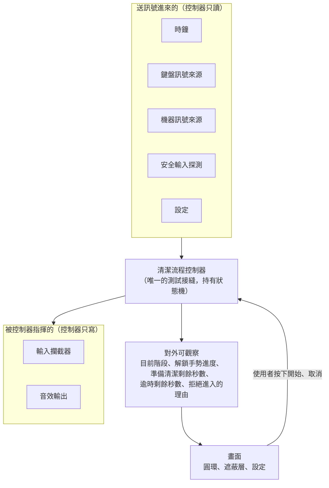

# Wipe 的接縫地圖

這份文件回答兩件事：接縫是什麼，以及這個專案有哪些接縫。

它是給人看的地圖，不是規格。每一個接縫該提供什麼，以 #1 的 Implementation Decisions 為準。

## 接縫是什麼

想像牆上的**插座**。檯燈不在乎插座後面接的是台電的電網，還是一顆行動電源。它只認得插座那個形狀。

接縫就是程式裡的插座。它是一個約定好的形狀，一邊插著真實世界（真的鍵盤、真的時間、真的喇叭），另一邊插著程式的邏輯。因為形狀是約定好的，測試的時候可以把真實世界那一頭拔掉，換上一個假的插進去。

為什麼需要這樣做？因為 Wipe 大部分的行為，測試沒辦法真的重現：

- 「五分鐘之後自動解除」，總不能讓測試真的等五分鐘。
- 「闔上螢幕蓋子就解除」，測試機沒有手可以闔蓋子。
- 「攔截鍵盤」，測試如果真的攔截了，跑測試的那台電腦就當場失去鍵盤。

有了接縫，測試可以說：「時鐘，直接跳到五分鐘後」「機器訊號，就當蓋子現在闔上了」「攔截器，你只要記下有人叫過你就好，什麼都不用真的做」。程式邏輯完全不知道自己在被騙，跑的是同一份程式碼。

反過來說，**接縫也是一種切割**。切得好，一邊的東西壞掉不會弄髒另一邊；切得太多，程式會被切得零零落落，每一塊都要花力氣維護。所以接縫要少而準。

## 這個專案只有一個測試接縫

Wipe 刻意只在**一個地方**開接縫：**清潔流程控制器**。

它是持有狀態機的那個東西，所有規格描述的行為都必須經過它。它不准直接讀系統時間、不准直接註冊系統事件、不准直接呼叫攔截 API。這些能力全部從外面注入進來。

## 七個接縫

| 接縫 | 真實世界那一頭 | 測試那一頭 | 現況 |
|---|---|---|---|
| **時鐘** | 系統時間 | 測試自己推進虛擬時間 | **已做（#4）** |
| **鍵盤訊號來源** | 真的鍵盤 | 直接餵假的按鍵狀態 | **已做（#3）** |
| **機器訊號來源** | 螢幕蓋子、系統睡眠喚醒 | 直接說「蓋子闔上了」 | 未做（#7） |
| **安全輸入探測** | macOS 的安全輸入模式 | 直接說「現在正在安全輸入模式」 | 未做（#8） |
| **輸入攔截器** | CGEventTap，真的丟棄事件 | 只記下「有人叫我開始攔截」 | 形狀已做，乾跑替身已做（#4）；真的攔截未做（#11、#12） |
| **音效輸出** | 喇叭 | 只記下「有人叫我播哪一聲」 | **已做（#4）** |
| **設定** | 使用者存在硬碟上的偏好 | 直接給一組值 | 值型別已做（#4）；設定畫面與持久化未做（#6） |

### 時鐘

負責回答「現在幾點」與「過了幾秒」。逾時解鎖、準備清潔的緩衝倒數、解鎖手勢按住的三秒，全部靠它。

有這個接縫，逾時相關的測試不需要真的等待。

它同時負責「每隔一小段時間叫我一次」。時間會走與時間要被讀是同一件事的兩面，
分成兩個接縫的話，測試就得同時騙兩個東西，而且還得自己讓它們對得起來。
真實那一頭是 `SystemClock`（`ProcessInfo.systemUptime` 加一個 run loop 計時器），
測試那一頭是 `TestClock`，一格一格走完測試喊的那段時間。

### 鍵盤訊號來源

回報四件事：左 Command 的按放狀態、右 Command 的按放狀態、是否夾帶其他修飾鍵、是否有其他按鍵按下。

解鎖手勢的每一條規則都建在這四個值上面，包括「出現第三顆按鍵就重新計時」。

目前的實作是 `LocalKeyboardSignalSource`，用 AppKit 的本機事件監看器，不需要任何系統授權，也不攔截或修改任何事件。#3 已在真機上確認左右 Command 分得開。

### 機器訊號來源

回報螢幕蓋子闔上，以及系統從睡眠喚醒。這兩個是闔蓋解鎖的訊號，也是使用者「手指一定按得到」的那條出路。

### 安全輸入探測

查詢目前是否處於安全輸入模式。這是 Wipe 最危險的失效來源：它啟動期間所有第三方鍵盤攔截都會被繞過，畫面會顯示清潔中，但鍵盤其實還活著。

有這個接縫，「偵測到就拒絕進入」與「進行中偵測到就立刻退出」這兩條規則測得到，不需要真的去把某個密碼欄位叫出來。

### 輸入攔截器

被要求以某個範圍（鍵盤鎖或全輸入鎖）開始攔截，以及被要求解除。

這是唯一一個「測試裡絕對不能用真貨」的接縫。真的攔截了，跑測試的那台電腦就沒有鍵盤了。

### 音效輸出

被要求播放某個時刻的音效：倒數每一秒、真正鎖上、手勢被認到、計時歸零、解鎖成功、逾時解除、拒絕進入。

測試不需要聽聲音，只需要確認「在對的時刻叫了對的那一聲」。

### 設定

純粹的值：緩衝要不要開、幾秒、逾時幾分鐘、按住幾秒、攔截範圍、各個音效開不開。

它是這七個裡面最單純的一個，不需要假的實作，測試直接給一組值就好。

注意：逾時解鎖、闔蓋解鎖、以及「解鎖手勢期間出現第三顆按鍵就重新計時」這三項**不在設定裡**，它們鎖死。設定只調整體驗，不拆保險（見 ADR-0002）。

## 一個順帶的好處：乾跑模式

「乾跑」是指真的讀鍵盤、真的跑完整個流程，但不真的鎖住鍵盤。開發期間非常需要它，否則每改一行程式都要冒著把自己鎖在外面的風險。

乾跑**不需要**成為第二個接縫。它只是在同一個接縫換一組替身：鍵盤訊號來源用真的，輸入攔截器用一個什麼都不做的。

這是接縫切得對的一個徵兆。如果為了乾跑得再開一個接縫，那表示原本那一刀切歪了。

## 什麼不是接縫

畫面上的東西（圓環、遮蔽層、設定視窗）**不是**接縫，也不需要是。

圓環收一個「現在是哪個階段」的值，把它畫出來，如此而已。它不持有時鐘，不持有狀態機，也不知道攔截這件事。這種只把值畫出來的東西，用眼睛看比寫測試划算。

真正需要被自動化測試守住的，是那些「用眼睛看不出來、但錯了會很嚴重」的規則。那些規則全部住在清潔流程控制器裡面。
